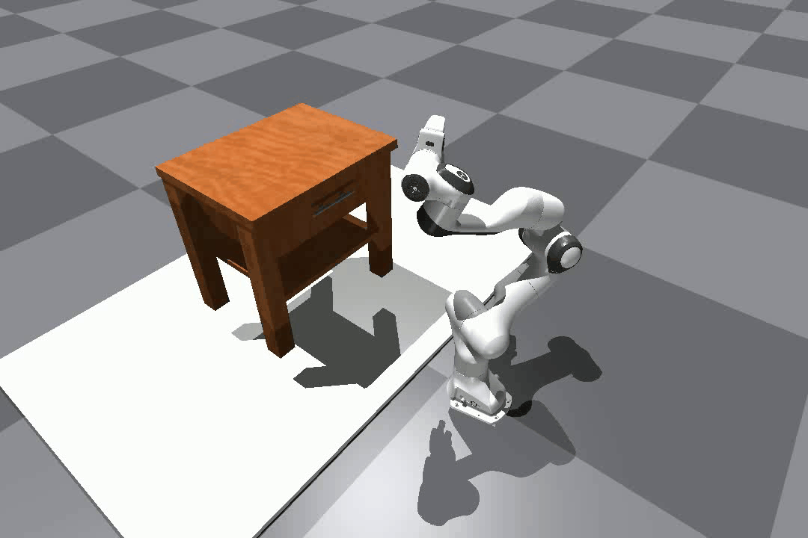

<h1 style="text-align: center; font-size: 1.5em; margin-bottom: 5px;">
  <a href="https://afforddp.github.io/" style="color:rgb(3, 168, 214); text-decoration: none;">
    AffordDP: Generalizable Diffusion Policy with Transferable Affordance
  </a>
</h1>
<div align="center">
  <a href="https://afforddp.github.io/"><strong>Project Page</strong></a>
  &nbsp;|&nbsp;
  <a href="https://arxiv.org/abs/2412.03142"><strong>arXiv</strong></a>
  &nbsp;|&nbsp;
  <a href="https://openaccess.thecvf.com/content/CVPR2025/html/Wu_AffordDP_Generalizable_Diffusion_Policy_with_Transferable_Affordance_CVPR_2025_paper.html"><strong>Paper</strong></a>
</div>

## Table of Contents
- [⚙️ Setup](#️-setup)
  - [Install Environment via Anaconda](#install-environment-via-anaconda-recommended)
  - [Install Pytorch3D](#install-pytorch3d)
  - [Install cuRobo](#install-curobo)
  - [Install GroundedSAM](#install-groundedsam)
  - [Install Point_SAM](#install-point_sam)
  - [Install IsaacGym](#install-isaacgym)
- [📦 Asset Preparation](#-asset-prepartion)
- [🛠️ Quick Start](#️-quick-start)
  - [Expert Demonstration Collection](#expert-demonstration-collection)
  - [Policy Training](#policy-training)
  - [Policy Evaluation](#policy-evaluation)
  - [Affordance Transfer Demo](#affordance-transfer-demo)
- [📚 Citation](#-citation)
- [Acknowledgement](#acknowledgement)

### ⚙️ Setup

#### Install Environment via Anaconda (Recommended)
```bash
# Create your python env
conda create -n afforddp python=3.8
conda activate afforddp
# Install torch
pip install torch==2.4.1 torchvision==0.19.1 torchaudio==2.4.1 --index-url https://download.pytorch.org/whl/cu118 
# Install Xformers, note the version compatibility with torch.
pip install -U xformers==0.0.28.post1 --index-url https://download.pytorch.org/whl/cu118
# Other package
pip install -r requirements.txt
```

#### Install [Pytorch3D](https://github.com/facebookresearch/pytorch3d/blob/main/INSTALL.md)
```bash
pip install "git+https://github.com/facebookresearch/pytorch3d.git"
```
#### Install [cuRobo](https://curobo.org/get_started/1_install_instructions.html)
```bash
cd third_party
cd curobo
pip install -e . --no-build-isolation
```
#### Install [GroundedSAM](third_party/GroundedSAM/README.md)
```bash
cd third_party
cd GroundedSAM
pip install -e GroundingDINO
pip install -e segment_anything
# Pretrained model weight
cd ../..
wget https://dl.fbaipublicfiles.com/segment_anything/sam_vit_h_4b8939.pth -P assets/ckpts/
wget https://github.com/IDEA-Research/GroundingDINO/releases/download/v0.1.0-alpha/groundingdino_swint_ogc.pth -P assets/ckpts/
```
#### Install [Point_SAM](https://github.com/zyc00/Point-SAM/blob/main/README.md)
```bash
cd third_party
cd Point_SAM
# Install torkit3d
pip install third_party/torkit3d
# Install apex
pip install -v --disable-pip-version-check --no-cache-dir --no-build-isolation --config-settings "--build-option=--cpp_ext" --config-settings "--build-option=--cuda_ext" third_party/apex
```
#### Install [IsaacGym](https://developer.nvidia.com/isaac-gym/download)
```bash
tar -zxvf IsaacGym_Preview_4_Package.tar.gz
cd isaacgym/python
pip install -e .
# You can test whether isaacgym can be used.
cd examples
python joint_monkey.py
```
### 📦 Asset Prepartion
You need to prepare the gapartnet assets. For download instructions, please follow this [link](https://github.com/PKU-EPIC/GAPartNet). Put them to `asset/partnet_mobility_part`.
```text
assets/
├── partnet_mobility_part/
│ ├── 4108/
│ ├── 7119/
│ ├── 7120/
│ ├── ...
```

### 🛠️ Quick Start
#### Expert Demonstration Collection  <a id="expert-demonstration-collection"></a>
You could generate demonstrations by yourself using our provided expert policies. Generated demonstrations are under `$YOUR_DATA_SAVE_PATH`. Default save path is `record`.
```bash
python collect_demonstrations.py --save_dir $YOUR_DATA_SAVE_PATH --obj_id $GAPartNet_obj_id --part_id $Manip_Part_id
```
By this way,  you will be able to collect expert trajectories for specific parts of an object.

**Example:** Collect demonstration for object ID 27044, part ID 1:
```bash
python collect_demonstrations.py --save_dir record --obj_id 27044 --part_id 1
```

This will generate:
- Expert trajectory data (`.npz` files)
- Rendered images showing each step
- An MP4 video (`trajectory.mp4`) at 20 fps
- An animated GIF (`trajectory.gif`)

**Example Output:**


After collection, you need to process these datasets.
```bash
python process_data.py --data_dir $YOUR_DATA_SAVE_PATH --save_dir $PROCESS_DATA_SAVE_PATH
```
The data processing script will convert all collected data into zarr format and save it to your specified directory. Default save path is `data`.

#### Policy Training
You need to modify the configuration parameters in `afforddp/config/task/PullDrawer.yaml`. Set `zarr_path` to your custom data path
```yaml
dataset:
  _target_: afforddp.dataset.Cabinet_afford_dataset.CabinetManipAffordDataset
  zarr_path: your/custom/path/to/data.zarr
  horizon: ${horizon}
  pad_before: ${eval:'${n_obs_steps}-1'}
  pad_after: ${eval:'${n_action_steps}-1'}
  seed: 42
  val_ratio: 0.00
  max_train_episodes: 90
```
```bash
sh train.sh ${seed} ${cuda_id}
```

#### Policy Evaluation
```bash
sh eval.sh ${ckpt_path} ${object_id}
```
#### Affordance Transfer Demo
Before running this demo, you must collect and process the required data. Please follow [this](#expert-demonstration-collection).
```bash
python demo.py
```
### Acknowledgement
Our code is generally built upon: [Diffusion Policy](https://github.com/real-stanford/diffusion_policy), [DP3](https://github.com/YanjieZe/3D-Diffusion-Policy), [RAM](https://github.com/yxKryptonite/RAM_code), [GAPartNet](https://github.com/PKU-EPIC/GAPartNet).  We thank all these authors for their nicely open sourced code and their great contributions to the community.

### 📚 Citation

If you find our work useful, please consider citing:
```
@inproceedings{wu2025afforddp,
  title={Afforddp: Generalizable diffusion policy with transferable affordance},
  author={Wu, Shijie and Zhu, Yihang and Huang, Yunao and Zhu, Kaizhen and Gu, Jiayuan and Yu, Jingyi and Shi, Ye and Wang, Jingya},
  booktitle={Proceedings of the Computer Vision and Pattern Recognition Conference},
  pages={6971--6980},
  year={2025}
}
```


